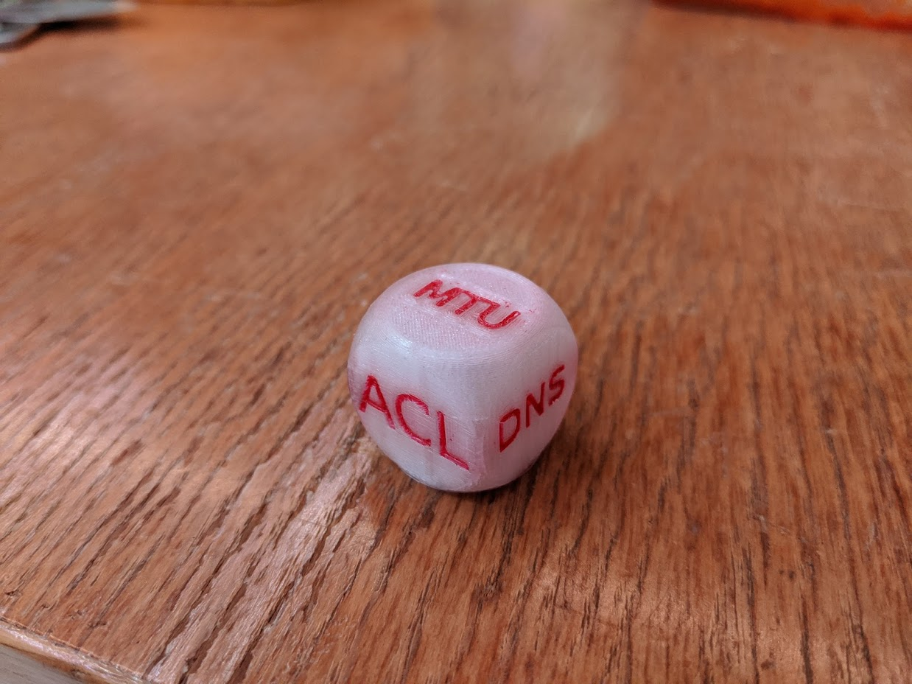

# Dice for Engineers

Dices for helping engineers in their daily troubleshooting tasks:

  * [Network Engineer](network.stl)
  * [System Engineer](sysadmin.stl)
  * [Helpdesk](helpdesk.stl)
  * [High Performance Computing](hpc.stl)

## Results

The following dices were printed on an Ultimaker 3 printer.


*Network Engineer Dice v1*

# Build

```
sudo apt install openscad fonts-open-sans
sudo pip3 install pillow
make
```

# Thanks

  * [Ultimate configurable dice by energywave](https://www.thingiverse.com/thing:1919139) licensed under Creative Commons - Attribution - Non-Commercial.
  * [FABLAB Renens](http://www.fablab-renens.ch/)

